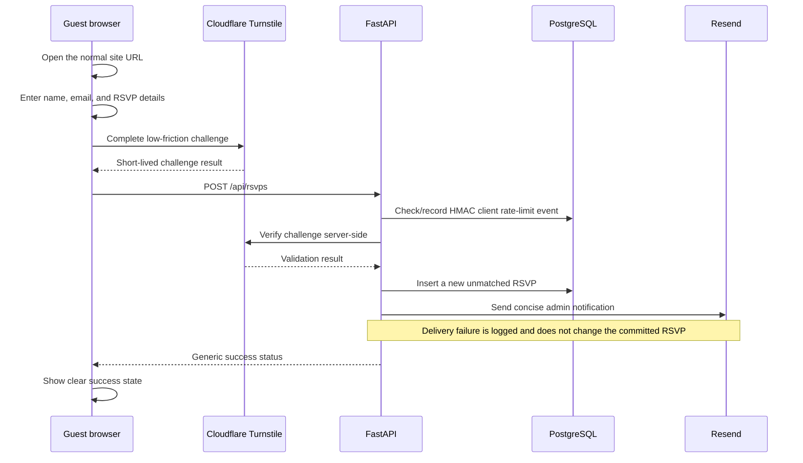

# Architecture and workflows

## System boundaries

The application is a React/TypeScript single-page application backed by a FastAPI/SQLModel API. The root Vercel deployment serves the built SPA and rewrites `/api/*` to the Python function. PostgreSQL is the production database; Docker Compose provides PostgreSQL locally and SQLite remains available for lightweight tests.

The public home page composes the hero, wedding details, public RSVP form, ArcGIS map, schedule, accommodation, travel, and footer. Schedule, accommodation, and travel use public read-only content endpoints. Admin-managed custom sections can be inserted into any gap between the hero and footer; the fixed section order remains defined in code. No guest-list or RSVP data is publicly readable.

Important frontend locations are:

- `pages/Home.tsx`, `pages/homepageComposition.ts`, and `components/HomepageCustomSection.tsx` — fixed/custom homepage composition and safe plain-text section rendering;
- `components/RSVPSection.tsx` — the public RSVP entry point;
- `components/RSVPForm.tsx` and `rsvpPayload.ts` — conditional form state, browser validation, normalization, and submission;
- `components/TurnstileWidget.tsx` — explicit Cloudflare Turnstile widget loading and lifecycle;
- `pages/Admin.tsx` and `components/admin/` — protected paper-invitation, RSVP, reconciliation, CSV, summary, and content workflows;
- `api/client.ts` and `adminClient.ts` — public/admin API base URLs and admin header handling.

Important backend locations are:

- `main.py` — FastAPI composition, CORS, `/api` mounts, and startup initialization;
- `models.py` — persisted entities and strict Pydantic request validation;
- `routers/rsvp.py` — write-only public RSVP endpoint;
- `abuse.py` — client fingerprinting, database rate limiting, and Turnstile verification;
- `routers/admin.py` — protected invitation, RSVP, reconciliation, export, summary, and content operations;
- `database.py` and `backend/migrations/` — table creation, explicit versioned migrations, compatibility columns, and default content.

## Public RSVP flow

The browser never reads an invitation record and stores no RSVP credential. The API does not search guests by name or email. A successful submission records the submitter's normalized name/email and response choices with `guest_id = null` until an administrator reconciles it.

Attendance-dependent fields are omitted from the UI when declining and normalized away before submission. The backend independently rejects inconsistent combinations. Additional guest names are required when the attending count exceeds one. Hotel nights appear only with a hotel-help request and at least one night is required for that request.

## Abuse protection

Public writes use layered controls:

- an invisible honeypot is quietly discarded;
- the client renders Turnstile, but the API is the authority and verifies every challenge with Cloudflare;
- the challenge action must be `rsvp`, and deployments may require an expected hostname;
- a keyed HMAC of the client address—not the raw address—is stored in `RSVPRateLimitEvent`;
- the API permits at most 10 attempts per 15 minutes and 30 per day for one fingerprint, deleting events older than one day;
- request schemas reject unknown fields, malformed email/name values, invalid conditional combinations, oversized text, and party sizes outside 1–6.

Missing abuse-protection secrets fail closed. Neither backend secret is sent to the browser, and the endpoint does not log form payloads or verification secrets.

## Duplicate submissions and future corrections

Every public submission creates a new `RSVP`, even when normalized name/email values match an existing record. This avoids treating an email address as authentication, allows legitimately shared addresses, preserves accidental/malicious repeats for review, and prevents an unauthenticated visitor from overwriting another response. Each persisted public submission therefore produces a separate “New RSVP” notification when notifications are configured. Protected admin edits do not send “new” or “updated” notifications.

The admin list shows the count of submissions using the same normalized email as a review signal. It is not proof that records represent the same person. Admins can explicitly match or unmatch each RSVP and can delete a confirmed unwanted duplicate.

The model supports a future guest confirmation/correction workflow because each RSVP has its own stable ID, contact snapshot, timestamps, and optional invitation relationship. Such a feature should issue a separate random management secret, store only its hash, and authorize only a narrowly scoped review/change-request flow. Email alone must not authorize changes. The current admin notification is one-way and contains no guest management credential.

## Invitation limits and reconciliation

`Guest` remains a private paper-invitation/party record with `max_guests` and `invite_sent`. Public visitors cannot prove which invitation they received, so the form uses a global safety cap of six and does not claim invitation-specific authorization.

Administrators explicitly associate an RSVP with a `Guest`. The backend then rejects reconciliation if the submitted count exceeds that invitation's `max_guests`. More than one RSVP may be linked to an invitation so repeated submissions remain visible. Deleting an invitation record unmatches linked RSVPs rather than deleting personal submissions.

## Admin and content flows

Every `/api/admin/*` route requires the `x-admin-secret` header. The browser keeps this value only in `sessionStorage`. Admin data includes personal information and must not be exposed publicly.

The dashboard can:

- create/delete paper-invitation records and mark invitations sent;
- view all submitted identifying/contact and event details;
- see submission and update timestamps plus same-email repeat signals;
- explicitly reconcile/unreconcile responses and enforce invitation party limits;
- delete RSVP submissions and export separate invitation/RSVP CSV files;
- view aggregate matched/unmatched and attendance summaries;
- create, edit, reorder, and delete schedule, accommodation, and travel content;
- create, edit, position, reorder, and delete reusable custom homepage sections.

Custom homepage sections use plain text rather than HTML or Markdown. React escapes the title, optional subtitle, and content, while CSS preserves intentional line breaks. An administrator selects one of seven stable placement slots: after the hero or after any of the six fixed content sections. Up/down controls reorder sections that share a slot and save immediately; changing the placement in the edit form moves the section to the end of the selected slot. This permits placement between any current fixed sections without moving the fixed components themselves into the database.

## RSVP notifications

After the RSVP transaction commits, the API sends a plain-text notification to the configured wedding-admin recipients through a small Resend HTTP adapter. The subject identifies the submitter; the body is limited to their name, attendance, party size, applicable accommodation request, UTC submission time, and optional admin link. Email address, additional guest names, dietary/medical details, private messages, and other RSVP text remain in the admin interface.

The delivery call has a short timeout and an RSVP-ID-based idempotency key. It runs after persistence and is isolated from the transaction: provider, network, or partial-configuration failures produce a metadata-only server error and the guest still receives the normal success response. An empty `RSVP_NOTIFICATION_EMAILS` setting disables delivery for local development and tests.

Real invitation records, RSVP contact data/text, CSV exports, provider credentials, admin secrets, and rate-limit secrets are sensitive and must stay out of source, logs, screenshots, fixtures, and documentation.

## Persistence conventions

`SQLModel.metadata.create_all()` creates missing tables only. Startup then runs the explicit public-RSVP, homepage-section, and RSVP-dietaries migrations, older additive RSVP/content compatibility checks, and default content seeding. The public-RSVP migration preserves legacy invitation/RSVP rows while removing invitation credential columns and the one-to-one RSVP constraint. The homepage migration deliberately creates the new section table for existing databases, while the dietaries migration adds the nullable RSVP text column. The migrations are repeatable, but this is not a general migration framework.

API paths are defined without `/api` in routers and mounted with that prefix in `main.py`. Admin routes add `/admin`. Content kinds remain closed to `schedule`, `accommodation`, and `travel`, ordered by `sort_order` then `id`.
