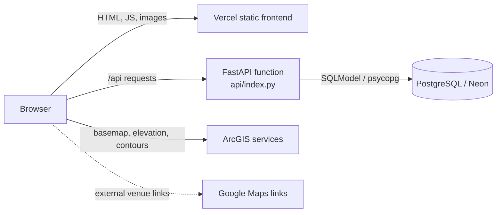

# Architecture and workflows

## System overview

The repository produces one browser application and one FastAPI application. The React build owns both the public page and `/admin`; FastAPI owns all `/api` routes and persistence. In production, Vercel serves the static build and routes API requests to a Python function. The backend accepts any SQLAlchemy-compatible database URL; the tracked deployment guidance targets PostgreSQL on Neon.



The custom production domain is configured outside the repository; no domain name or Vercel project metadata is encoded in the tracked files.

## Frontend

`frontend/src/main.tsx` mounts `App`. `App.tsx` uses a pathname check rather than a routing library:

- `/admin` renders `pages/Admin.tsx`.
- Every other pathname renders `pages/Home.tsx`; Vercel's catch-all rewrite serves `index.html` for those paths.

The public home page composes a photo carousel, static wedding details, RSVP, an ArcGIS map, schedule, accommodation, travel, and footer sections. Schedule, accommodation, and travel fetch database-backed entries from the public content API. The main wedding date/location copy, venue links, map coordinates and layers, hero images, and email-template copy/assets remain in source or public assets.

Axios clients in `src/api/` centralize public and admin base URLs. RSVP forms use `react-hook-form`; `rsvpPayload.ts` converts radio values to API booleans and has a focused unit test.

The map loads ArcGIS basemap, elevation, and contour services directly in the browser. Google Maps is used only through ordinary outbound links. No ArcGIS key or email-delivery integration is configured in this repository.

## Backend

`backend/app/main.py` creates the FastAPI app, installs CORS middleware, registers the public RSVP/content routers and the admin router, and initializes the database during application startup. Important source locations are:

- `models.py` — SQLModel tables plus Pydantic request models.
- `database.py` — engine/session creation, table creation, limited compatibility alterations, and default content seeding.
- `routers/rsvp.py` — invitation lookup and public RSVP submission.
- `routers/content.py` — public site-content reads.
- `routers/admin.py` — protected guest, RSVP, content, summary, import, and export operations.
- `routers/utils.py` — shared-secret verification for admin routes.

`backend/main.py` re-exports the app for package imports. `api/index.py` imports that re-export as Vercel's function entrypoint.

## Invitation and RSVP flow

```mermaid
sequenceDiagram
    participant Guest as Guest browser
    participant SPA as React SPA
    participant API as FastAPI
    participant DB as Database

    Guest->>SPA: Open /?token=personal-token
    SPA->>SPA: Prefer query token; otherwise read localStorage
    SPA->>SPA: Store token in browser localStorage
    SPA->>API: GET /api/guest/{token}
    API->>DB: Find Guest and optional RSVP
    DB-->>API: Invitation and existing response
    API-->>SPA: Guest capabilities and RSVP fields
    Guest->>SPA: Submit or revise RSVP
    SPA->>API: POST /api/rsvp/{token}
    API->>DB: Insert or update the guest's single RSVP
    API-->>SPA: Success
```

The token is a bearer credential: anyone with the link can read that guest's invitation response and submit an update. The browser stores a valid candidate in `localStorage` for later visits. If lookup fails, it clears the stored token and hides the form.

The form always captures attendance, Sunday attendance, accommodation-help interest, requested room nights, dietary requirements, and a message. The party-size input is displayed only when `plus_one_allowed` is true. The API, however, enforces the numeric `max_guests` limit; that field is the server-side authority. A later submission updates the existing RSVP rather than adding a history record.

## Admin flow

The `/admin` page asks for the shared admin secret and stores it in browser `sessionStorage`. Each admin API call sends it in `x-admin-secret`; there is no user-account, cookie-session, role, or external identity system.

After verification the dashboard can:

- show guest/response summary counts;
- create and delete guests, mark invitations sent, and edit or clear an RSVP;
- copy or download personalized HTML invitation templates and download the guest/RSVP CSV;
- create, update, reorder, and delete schedule, accommodation, and travel entries.

Email templates are generated and exported in the browser. The application does not send email. A backend CSV import endpoint exists, but the current admin page does not expose an upload control.

Real guest records, RSVP text, personal tokens, CSV exports, and generated invitations are sensitive. Keep them out of source, logs, screenshots, fixtures, and documentation.

## Persistence and startup

`SQLModel.metadata.create_all()` creates missing tables. Startup then runs hand-written, additive compatibility checks and seeds defaults for any content kind with no entries. These checks are not a general migration system; see [Data model and API](data-and-api.md) and [Deployment](deployment.md) for their exact scope and operational consequences.

## Architectural conventions

- API paths are defined without `/api` in routers and mounted with that prefix in `main.py`.
- Admin routes receive an additional `/admin` prefix from their router.
- Public content kinds are a closed set: `schedule`, `accommodation`, and `travel`.
- One guest has at most one RSVP, enforced by the unique `rsvp.guest_id` column.
- Dynamic content ordering is persisted through `sort_order`, then `id`.
- Static, public assets are under `frontend/public`; bundled hero photos are loaded from `frontend/src/assets/hero-photos` using `import.meta.glob`.
